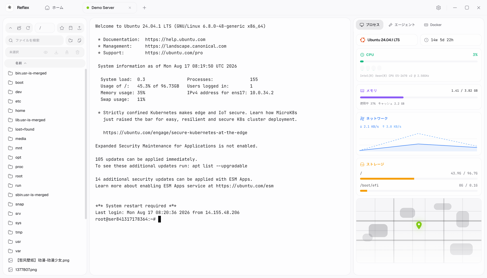
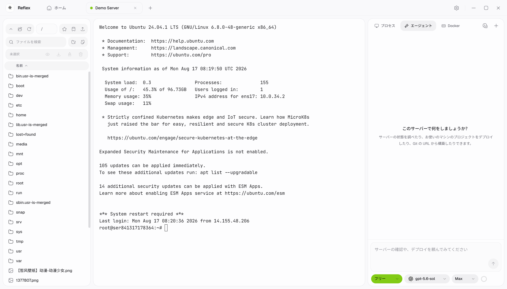
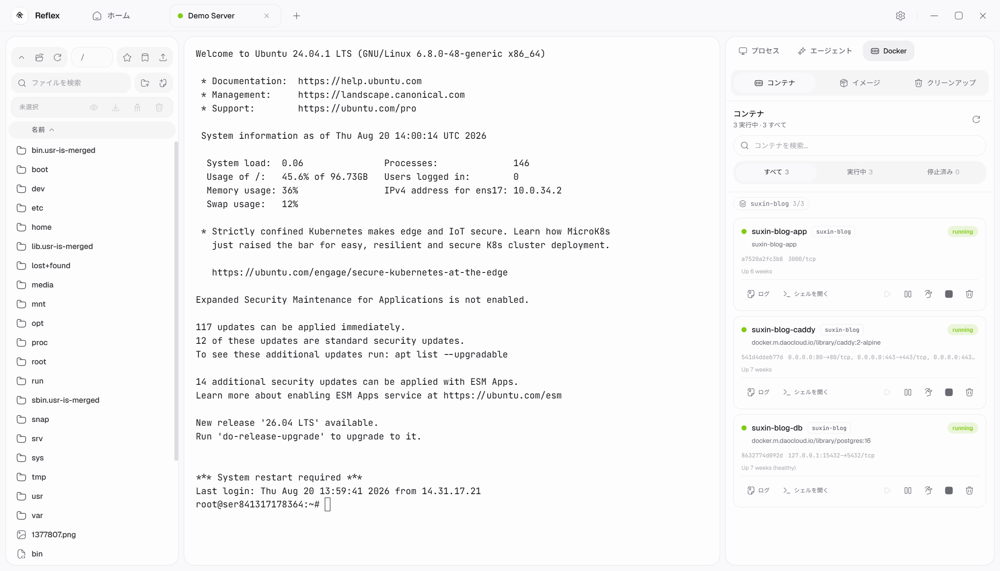
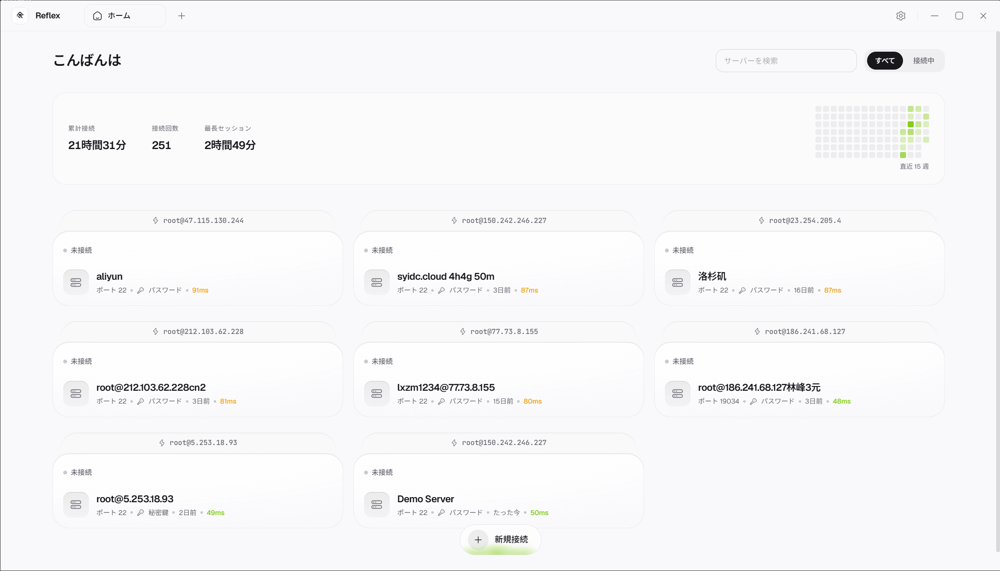
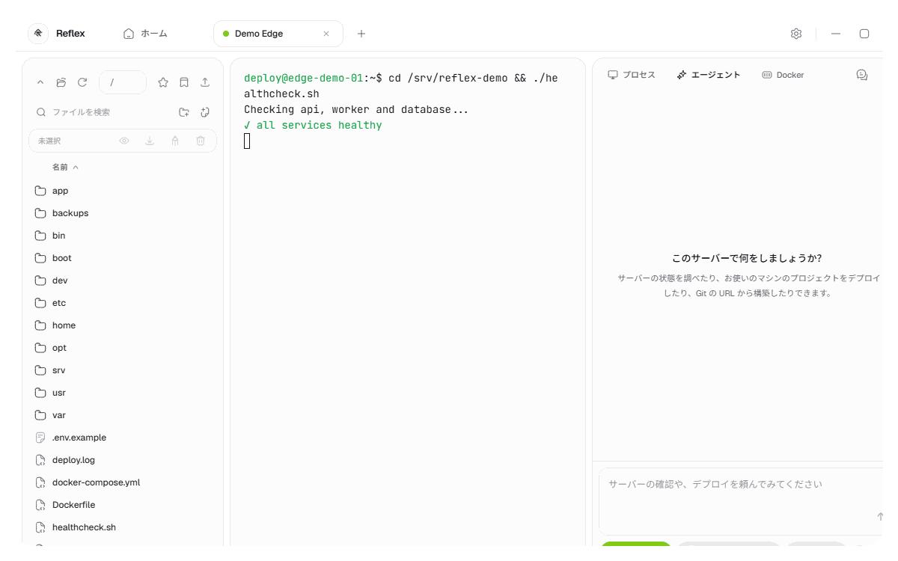
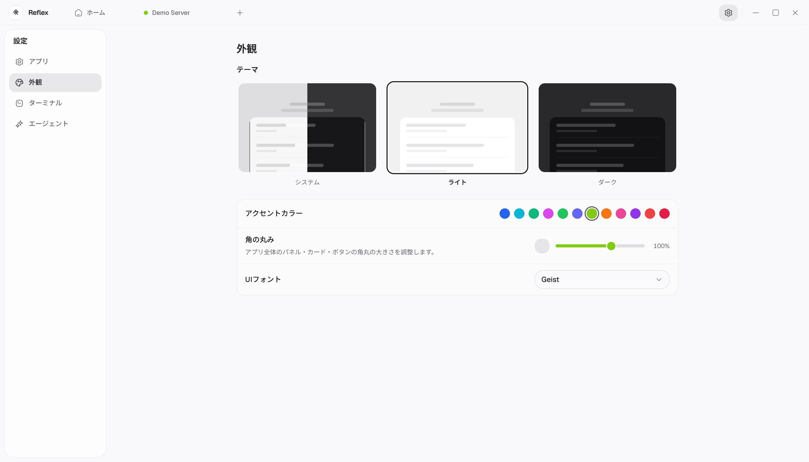
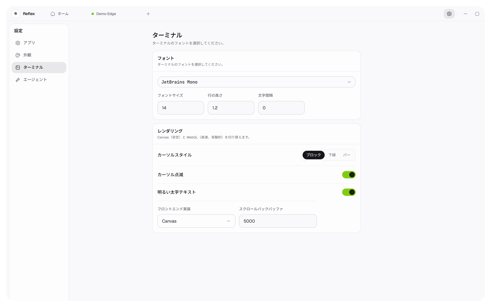
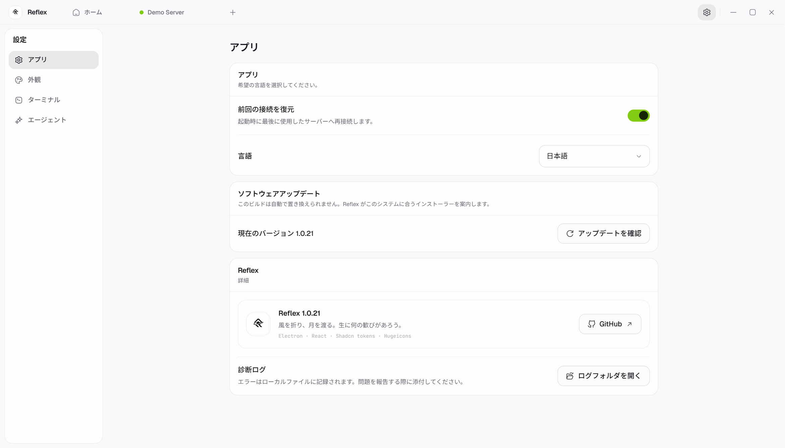

<div align="center">
  <a href="https://github.com/Sunhaiy/Reflex">
    
  </a>

  <h1>Reflex</h1>

  <p>
    マルチセッション端末、SFTP、Docker、監視、デプロイ自動化、AI 支援のサーバー作業を 1 つのデスクトップアプリで扱えます。
  </p>

  <p>
    <a href="./README.md">English</a>
    |
    <a href="./README.zh-CN.md">简体中文</a>
    |
    <a href="./README.ja.md">日本語</a>
    |
    <a href="./README.ko.md">한국어</a>
  </p>

  <p>
    <a href="https://github.com/Sunhaiy/Reflex/actions/workflows/build-release.yml">
      
    </a>
    <a href="./LICENSE">
      
    </a>
    
    
    
    
  </p>

  <p>
    <sub>
      リモートサーバーをよりローカルに、観測しやすく、修復しやすく扱いたい開発者のために作られています。
    </sub>
  </p>
</div>

---

<div align="center">
  <a href="https://github.com/Sunhaiy/Reflex">
    <picture>
      <source media="(prefers-color-scheme: dark)" srcset="./docs/screenshots/ja/workspace-real.png" />
      <source media="(prefers-color-scheme: light)" srcset="./docs/screenshots/ja/workspace-real.png" />
      
    </picture>
  </a>
</div>

## 概要

**Reflex** は、実際のサーバー作業に合わせて設計されたクロスプラットフォームの SSH デスクトップクライアントです。接続、調査、編集、デプロイ、復旧、そして作業コンテキストの継続を 1 つの流れで扱えます。

洗練された端末ワークスペース、実用的なインフラツール、Agent モードを組み合わせています。Agent はサーバー側タスクを計画し、コマンドを実行し、出力を確認し、一時的な失敗ではリトライし、実行の流れを見える形で残します。

## 製品ツアー

<p align="center">
  
</p>
<p align="center">
  <b>Agent</b><br />ツール手順、コマンド、結果、ストリーミング回答を表示。
</p>

<p align="center">
  
</p>
<p align="center">
  <b>Docker</b><br />コンテナ、イメージ、ポート、ログ、ライフサイクル操作。
</p>

<p align="center">
  
</p>
<p align="center">
  <b>接続フロー</b><br />SSH 接続、端末、ファイルツリー、監視がワークスペースに読み込まれます。
</p>

<p align="center">
  
</p>
<p align="center">
  <b>Agent フロー</b><br />プロンプト、ツール履歴、端末出力、ストリーミング回答を連続表示。
</p>

<p align="center">
  
</p>
<p align="center">
  <b>外観</b>：テーマ、アクセント、角丸、フォント。
</p>

<p align="center">
  
</p>
<p align="center">
  <b>端末</b>：描画、カーソル、文字組み、スクロールバック。
</p>

<p align="center">
  
</p>

## Reflex を選ぶ理由

- **リモート作業を 1 つの場所に集約:** 端末、ファイル、Docker、監視、AI アクションを並べて扱えます。
- **Agent ネイティブな実行:** 目標を伝えるだけで、計画、コマンド、進捗、検証ステップを追えます。
- **ローカルファーストな設定:** 接続プロファイル、AI 設定、テーマ、セッション履歴はローカルに保存されます。
- **再開できるセッション:** サーバー切り替えやアプリ再起動後も、Agent の会話とタスク状態を復元できます。
- **デスクトップ配布:** Electron Builder と GitHub Actions で Windows、macOS、Linux 向けにビルドできます。

## 機能

### Terminal And SSH

- 永続化された端末状態を持つマルチセッション SSH タブ
- パスワード認証と秘密鍵認証
- 再接続を考慮したコマンド実行
- インライン AI コマンド生成と選択範囲アクション
- 複数プリセットを備えたテーマ対応の端末表示

### Agent Workspace

- 自然言語によるサーバー運用タスクの実行
- 長時間タスクの計画、進捗、リトライ状態
- ローカルコマンド、リモートコマンド、アップロード、ファイル書き込み、ツール結果をカードで表示
- ローカルフォルダーと GitHub プロジェクト向けのデプロイワークフロー
- 以前の作業を続けられるセッション履歴

### Files And Deployment

- SFTP ファイルブラウザーとリモートファイル編集
- アップロード、ダウンロード、リネーム、削除、ディレクトリ作成
- デプロイフロー向けのプロジェクトパッケージング
- リモート Nginx / 静的サイトデプロイ対応
- GitHub プロジェクトのソース解決とサーバー側準備

### Server Management

- CPU、メモリ、ディスク、ネットワークのリアルタイム監視
- プロセス一覧と kill 操作
- Docker コンテナ、イメージ、ログ、クリーンアップ操作
- サーバープロファイルの検索、コピー、編集、削除、クイック接続

### Customization

- ライト、ダーク、ブラック、サイバーパンク、カスタムアクセントテーマ
- UI フォントと端末フォントの設定
- 複数の AI プロバイダープロファイル
- 同一プロバイダーエンドポイントで複数モデルを選択可能
- ローカライズされた UI オプション

## クイックスタート

Node.js `>=22.12.0` が必要です。Node.js 24 を推奨します。

```bash
git clone https://github.com/Sunhaiy/Reflex.git
cd Reflex
npm ci
npm run dev
```

## ビルド

```bash
npm run build
npm run dist
```

プラットフォーム別パッケージング:

```bash
npm run dist:win
npm run dist:mac
npm run dist:linux
```

## プロジェクト構成

```text
reflex
|- electron/            # Electron main process, IPC, SSH, deploy engine, agent runtime
|- src/                 # React renderer source
|  |- components/       # Terminal, Agent, Docker, files, monitor UI
|  |- pages/            # Settings and connection management
|  |- services/         # Frontend AI and app services
|  |- shared/           # Shared types, themes, locales, prompts
|  `- store/            # Zustand stores
`- .github/workflows/   # Build and release automation
```

## 技術スタック

- Electron
- React
- TypeScript
- Vite
- Tailwind CSS
- Zustand
- xterm.js
- ssh2
- Monaco Editor
- Recharts

## コントリビューション

コントリビューションを歓迎します。issue や pull request を作成する前に、[CONTRIBUTING](./CONTRIBUTING.md) と [CODE_OF_CONDUCT](./CODE_OF_CONDUCT.md) を確認してください。

## セキュリティ

セキュリティ上の問題を見つけた場合は、[SECURITY](./SECURITY.md) の手順に従ってください。

## ライセンス

[LICENSE](./LICENSE) を参照してください。
