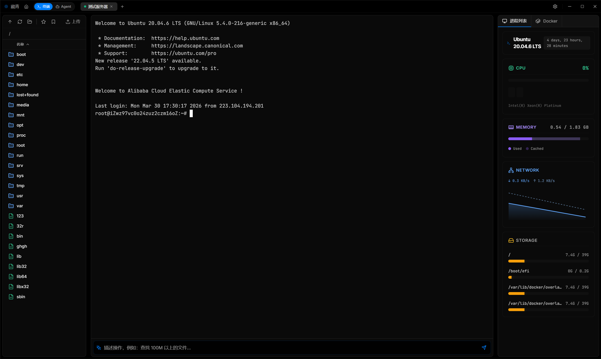
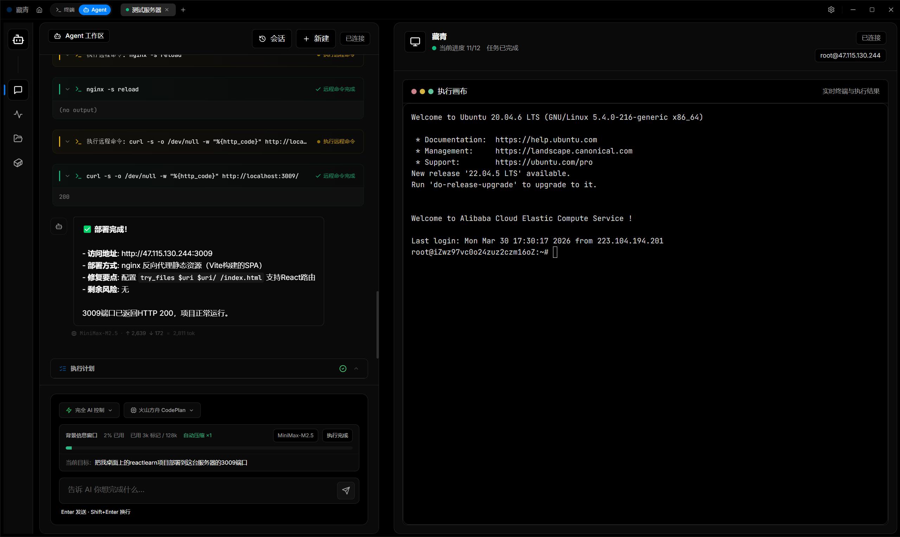
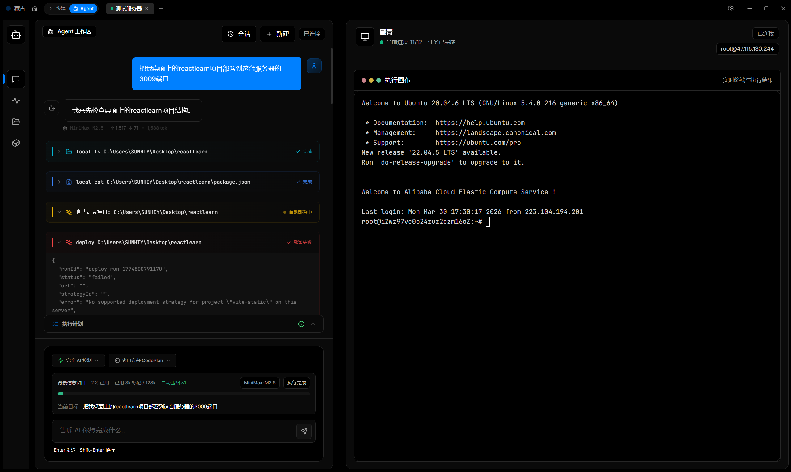

<div align="center">

# Zangqing

**SSH 터미널, AI 작업 공간, Docker 관리, SFTP, 서버 모니터링을 하나로 묶은 현대적인 데스크톱 클라이언트입니다.**

[English](./README.md) | [简体中文](./README.zh-CN.md) | [日本語](./README.ja.md) | [한국어](./README.ko.md)


</div>

## 미리보기







## 소개

Zangqing은 실제 운영 흐름에 맞춰 설계한 데스크톱 SSH 클라이언트입니다. 원격 터미널, 파일 전송, Docker 제어, 시스템 모니터링, AI 작업 공간을 한 화면에 통합해서 연결부터 점검, 배포, 검증까지 한 앱 안에서 이어서 처리할 수 있습니다.

## 주요 기능

- `ssh2` 와 `xterm.js` 기반 멀티 세션 터미널
- 배포와 진단을 위한 Agent 작업 공간
- 내장 SFTP 파일 브라우저와 인라인 편집기
- Docker 컨테이너 관리
- CPU, 메모리, 네트워크, 디스크 원격 모니터링
- 대화와 세션 상태의 로컬 영속 저장
- Electron Builder 기반 크로스플랫폼 패키징

## 구성

### 터미널과 파일 작업

- 대화형 원격 터미널
- SFTP 트리 브라우징
- 파일 직접 편집
- 탭 기반 세션 관리

### Agent 작업 공간

- 자연어 작업 실행
- 배포 중심 워크플로
- 컨텍스트 유지와 대화 이어서 실행
- 채팅과 실행 결과 동시 표시

### 서버 관리

- Docker 매니저
- 프로세스 목록
- 시스템 모니터
- 연결 설정 저장과 재사용

## 시작하기

```bash
git clone https://github.com/Sunhaiy/sshtool.git
cd sshtool
npm install
npm run dev
```

## 빌드

```bash
npm run build
npm run dist
```

플랫폼별 빌드:

- `npm run dist:win`
- `npm run dist:mac`
- `npm run dist:linux`

## 디렉터리 구조

```text
sshtool
|- electron/            # Electron 메인 프로세스, IPC, SSH, 배포 엔진
|- src/                 # React 렌더러
|  |- components/       # Terminal, Agent, Docker, files, monitor UI
|  |- pages/            # 설정과 연결 관리
|  |- services/         # 프런트엔드 서비스
|  |- shared/           # 공통 타입과 로케일
|  `- store/            # Zustand 스토어
|- docs/                # 설계 및 문서
`- .github/workflows/   # 빌드와 릴리스
```

## 기술 스택

- Electron
- React
- TypeScript
- Vite
- Tailwind CSS
- Zustand
- xterm.js
- ssh2
- Monaco Editor
- Recharts

## 라이선스

[LICENSE](./LICENSE)를 참고하세요.
