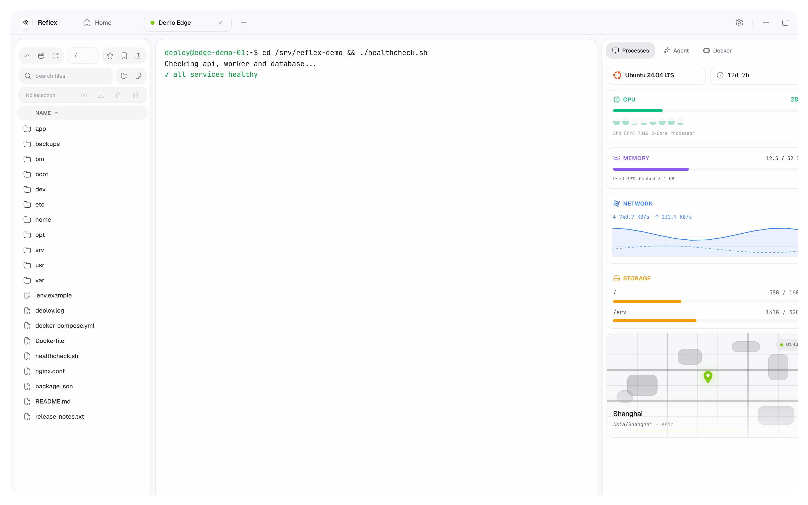
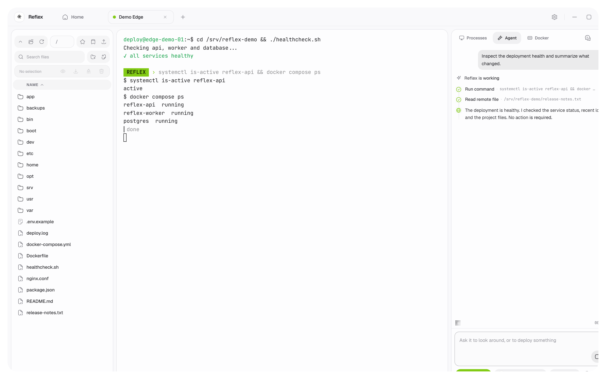
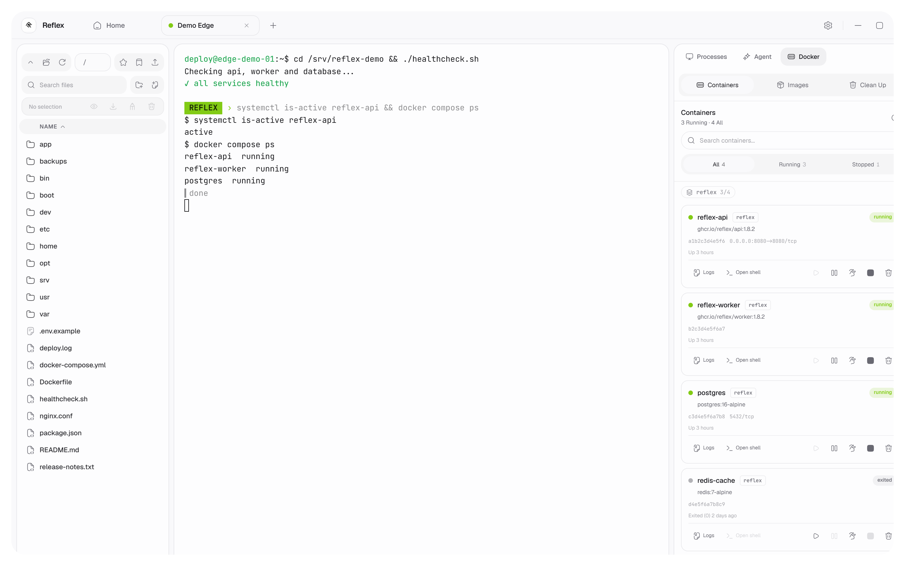
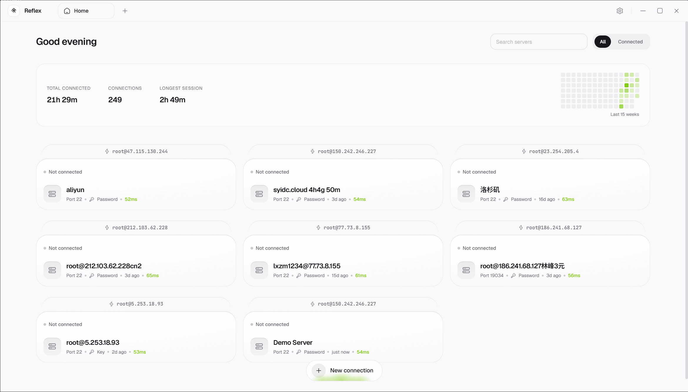
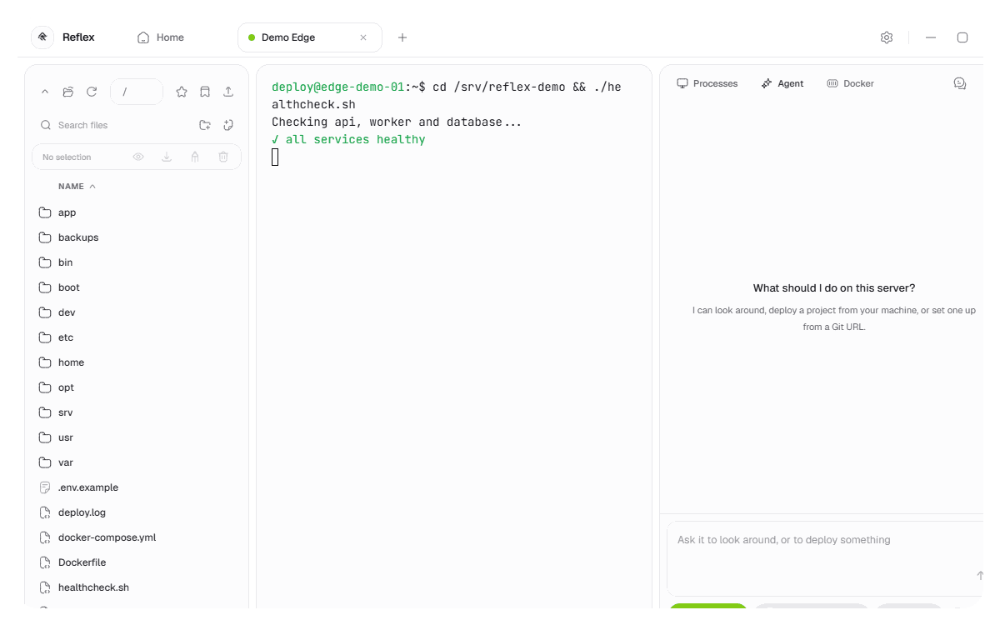
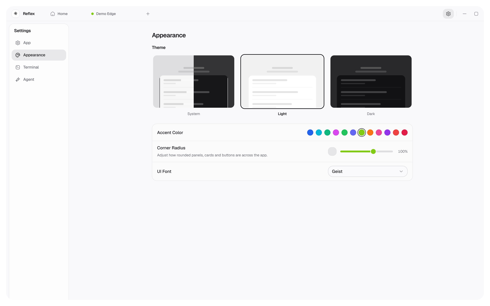
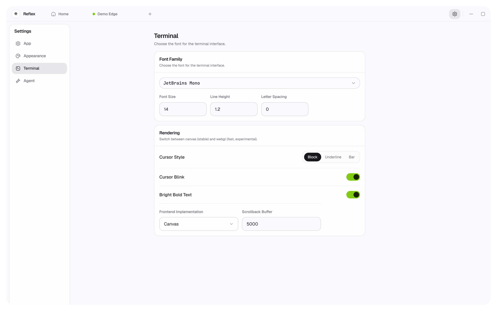
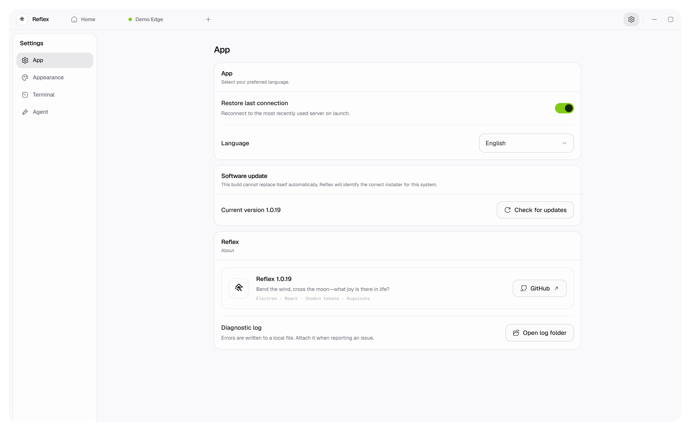

<div align="center">
  <a href="https://github.com/Sunhaiy/Reflex">
    
  </a>

  <h1>Reflex</h1>

  <b>Bend the wind, cross the moon—what joy is there in life?</b>

  <p>
    A modern SSH operations workspace with terminal sessions, SFTP, Docker,
    live monitoring, and an Agent-native workflow in one desktop app.
  </p>

  <p>
    <a href="./README.md">English</a>
    |
    <a href="./README.zh-CN.md">简体中文</a>
    |
    <a href="./README.ja.md">日本語</a>
    |
    <a href="./README.ko.md">한국어</a>
  </p>

  <p>
    <a href="https://github.com/Sunhaiy/Reflex/actions/workflows/build-release.yml">
      
    </a>
    <a href="https://github.com/Sunhaiy/Reflex/releases/latest">
      
    </a>
    <a href="./LICENSE">
      
    </a>
    
    
  </p>
</div>

---

<p align="center">
  
</p>

## Overview

**Reflex** is a cross-platform SSH desktop client built around real server work: connect, inspect, edit, deploy, recover, and continue with the same context after switching tasks or reopening the app.

It combines a focused terminal workspace with practical infrastructure tools and an Agent that can execute visible server operations without exposing hidden reasoning. Connection profiles, preferences, provider credentials, and Agent history remain local to the application.

## Why Reflex

- **One remote workspace:** terminal, files, Docker, monitoring, and Agent actions stay side by side.
- **Agent-native execution:** describe an outcome and follow the visible commands, progress, approvals, and results.
- **Recoverable sessions:** terminal state and Agent conversations survive task switching and application restarts.
- **Local-first configuration:** connection and provider settings are stored on the device.
- **Cross-platform releases:** packaged for Windows, macOS Intel/Apple Silicon, and Linux.

## Features

### Terminal and SSH

- Multiple SSH connections and terminal sessions
- Password, private-key, and jump-host authentication
- Canvas or WebGL rendering, configurable cursor, fonts, spacing, and themes
- Reconnect-aware command execution with preserved ANSI terminal styling

### Agent workspace

- Natural-language server operations with visible progress and tool output
- Persistent, switchable, and deletable conversations
- Model, provider, context budget, and reasoning-effort controls
- Approval handling for sensitive commands and file changes
- Markdown responses with safe links and copyable code blocks

### Files and deployment

- SFTP browsing, upload, download, rename, edit, delete, and directory creation
- Remote file preview and editor workflows
- Smooth skeleton-to-content transitions when entering directories
- Deployment-oriented project and server preparation tools

### Server management

- CPU, memory, disk, network, and process monitoring
- Docker containers, images, logs, shell access, and cleanup
- Connection usage history and quick profile search
- Startup readiness checks that avoid requests before SSH is connected

### Personalization

- System, light, and dark appearances with configurable accent colors
- Adjustable corner radius and interface/terminal font families
- English, Simplified Chinese, Japanese, Korean, and Italian UI

## Product tour

<table>
  <tr>
    <td width="50%"></td>
    <td width="50%"></td>
  </tr>
  <tr>
    <td align="center"><b>Agent</b><br />Visible tool steps, commands, results, and streaming responses.</td>
    <td align="center"><b>Docker</b><br />Containers, images, ports, logs, and lifecycle actions.</td>
  </tr>
</table>

<table>
  <tr>
    <td width="50%"></td>
    <td width="50%"></td>
  </tr>
  <tr>
    <td align="center"><b>Connection flow</b><br />SSH connection, terminal, file tree, and monitoring load into a ready workspace.</td>
    <td align="center"><b>Agent flow</b><br />Prompt, tool timeline, terminal output, and streamed answer in one continuous run.</td>
  </tr>
</table>

<table>
  <tr>
    <td width="50%">
      
    </td>
    <td width="50%">
      
    </td>
  </tr>
  <tr>
    <td align="center"><b>Appearance</b><br />Themes, accent color, radius, and fonts.</td>
    <td align="center"><b>Terminal</b><br />Rendering, cursor, typography, and scrollback.</td>
  </tr>
</table>

<p align="center">
  
</p>

## Download

Installers for Windows, macOS, and Linux are available from the [latest release](https://github.com/Sunhaiy/Reflex/releases/latest).

## Development

Requirements: Node.js `>=22.12.0` (Node.js 24 recommended) and npm.

```bash
git clone https://github.com/Sunhaiy/Reflex.git
cd Reflex
npm ci
npm run dev
```

Build and package:

```bash
npm run build
npm run dist
```

Platform-specific packaging:

```bash
npm run dist:win
npm run dist:mac
npm run dist:linux
```

## Project structure

```text
electron/       Electron main process, IPC, SSH, SFTP, monitoring, and Agent runtime
src/            React renderer, application UI, themes, stores, and localization
docs/           Documentation assets and sanitized product screenshots
.github/        Cross-platform build and release workflows
```

## Tech stack

- Electron 43
- React 18 and TypeScript
- Vite 8 and Tailwind CSS
- Zustand
- xterm.js and ssh2
- React Markdown

## Security

Please report security issues using the process described in [SECURITY](./SECURITY.md). Do not publish credentials, connection profiles, logs, or server addresses in public issues.

## Contributing

Contributions are welcome. Read [CONTRIBUTING](./CONTRIBUTING.md) and [CODE_OF_CONDUCT](./CODE_OF_CONDUCT.md) before opening an issue or pull request.

## License

See [LICENSE](./LICENSE) and [THIRD_PARTY_NOTICES](./THIRD_PARTY_NOTICES.md).
