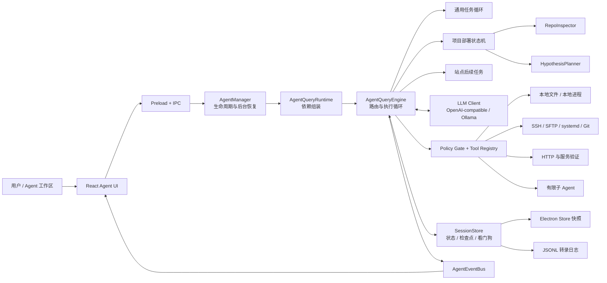
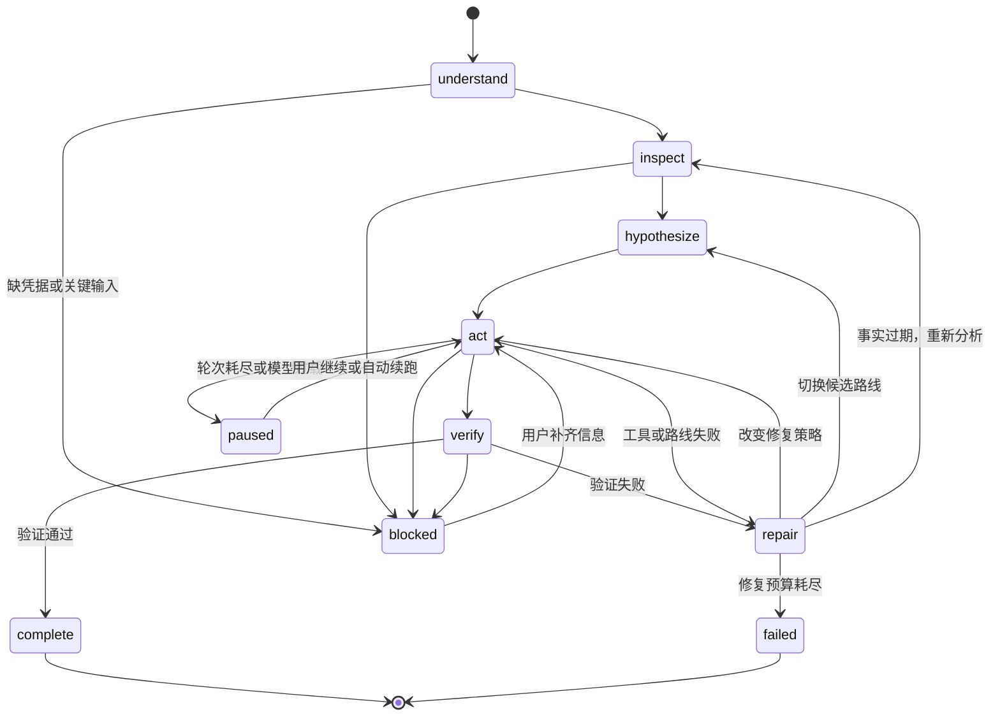

# Reflex Agent 技术方案

> 文档状态：Draft v1.0  
> 代码基线：`18babe1`（2026-06-09）  
> 更新日期：2026-07-14  
> 适用范围：Reflex 桌面端的 Agent 工作区、SSH 运维任务与项目部署任务

## 1. 方案摘要

Reflex 现有 Agent 已经具备较完整的自主任务执行能力。建议保留当前“Electron 主进程持有 Agent 大脑”的总体架构，在此基础上补齐安全策略、验证协议、恢复一致性和可观测性。

推荐的目标方案是：

- 以 `AgentManager` 管理会话生命周期和后台恢复；
- 以 `AgentQueryEngine` 作为统一任务路由器和执行循环；
- 普通运维任务走通用 Tool Loop，部署任务走“仓库分析 → 路线假设 → 执行 → 外部验证 → 自修复”的专用状态机；
- 所有本地、远程和系统级动作统一经过类型化工具层；
- 在工具层前新增强制策略门禁，而不是仅依靠 Prompt 约束危险操作；
- 以会话快照、JSONL 转录、检查点和压缩记忆支持暂停、重启及异常后的续跑；
- 只把通过明确验证器的结果标记为完成。

一句话定义：**Reflex Agent 是运行在 Electron 主进程中的、面向 SSH 运维与部署场景的可恢复自主执行引擎。**

## 2. 背景与目标

Reflex 是一个集终端、SFTP、Docker、监控、部署和 AI 操作为一体的 SSH 桌面工作台。Agent 的价值不是只生成命令，而是围绕用户目标持续执行，直到任务完成、失败预算耗尽或确实需要用户输入。

### 2.1 建设目标

1. 用户用自然语言描述目标后，Agent 能自行检查本地项目和远程服务器。
2. 部署任务能够选择合适路线，并在失败后修复或切换路线。
3. 长任务可见、可停止、可恢复，不因窗口关闭或模型限流丢失状态。
4. 本地文件、远程命令、服务操作和传输行为可审计。
5. 高风险动作必须经过确定性的策略判断，必要时由用户批准。
6. “任务完成”必须有与任务类型匹配的验证证据。

### 2.2 非目标

- 不把 Agent 设计成无限制的通用桌面自动化工具；
- 不允许子 Agent 无边界递归创建子 Agent；
- 不以模型自行声明成功作为生产部署成功的唯一依据；
- 不在当前阶段引入外部分布式调度系统，单机 Electron 主进程足够承载现有规模。

## 3. 当前实现盘点

当前代码已经落地以下能力：

- 主进程 Agent 生命周期管理；
- 通用任务、项目部署任务、站点后续任务三类路由；
- 25 个类型化工具，覆盖本地文件、本地命令、SSH、SFTP、systemd、HTTP 探测、Git、Todo 和子 Agent；
- 本地目录与 GitHub 仓库分析；
- Compose、Dockerfile、Java、Python、Node、静态 Nginx 六类部署路线假设；
- 路线评分、失败分类、路线切换和最多五轮自主修复；
- 检查点、进度签名、看门狗、模型重试和后台自动续跑；
- Electron Store 会话快照与 JSONL 转录双层持久化；
- 长上下文自动压缩和项目记忆文件加载；
- 默认只读、有限轮次、禁止递归 fork 的子 Agent；
- React 端的计划、工具卡片、任务状态、Todo、子任务和上下文窗口展示。

### 3.1 关键代码映射

| 模块 | 当前职责 |
| --- | --- |
| `electron/agent/manager.ts` | 启动、恢复、停止、清理、限流后自动续跑、运行态持久化 |
| `electron/agent/runtime/queryRuntime.ts` | 组装 Inspector、Planner、Tool Registry、Compact Service、Fork Service 和 Query Engine |
| `electron/agent/query/queryEngine.ts` | 任务路由、LLM Tool Loop、部署状态机、验证、修复、看门狗 |
| `electron/agent/state/sessionStore.ts` | 会话状态、任务状态、检查点、进度、恢复、失败分类、完成判定 |
| `electron/agent/toolRegistry.ts` | 25 个本地及远程工具的定义与执行 |
| `electron/agent/repoInspector.ts` | 本地项目扫描、GitHub 远程检出、服务器能力检查 |
| `electron/agent/hypothesisPlanner.ts` | 部署路线生成、证据收集、能力要求、反证信号和评分 |
| `electron/agent/runtime/forkedAgent.ts` | 有限轮次子 Agent 与只读工具集 |
| `electron/agent/memory/memoryLoader.ts` | 加载用户、工作区、项目级记忆文件 |
| `electron/agent/services/compact/*` | 长上下文压缩与降级摘要 |
| `electron/agent/state/transcriptStore.ts` | 消息、任务、进度、子 Agent 的 JSONL 追加日志与恢复 |
| `electron/agent/runtime/eventBus.ts` | 主进程到渲染进程的计划及消息事件 |
| `electron/ipcHandlers.ts`、`electron/preload.ts` | Agent IPC 边界 |
| `src/components/AIChatPanel.tsx` | 启停、恢复、事件订阅、会话快照和消息展示 |
| `src/components/AgentTaskOverview.tsx` | 任务阶段、路线、检查点、Todo 和子任务概览 |

## 4. 总体架构



图中的 `Policy Gate` 是建议新增的强制安全边界；其余主体均已有代码基础。

### 4.1 为什么 Agent 放在主进程

- SSH 连接、SFTP、文件系统和本地进程本来就在主进程侧；
- 避免渲染进程刷新导致长任务中断；
- 避免浏览器 CORS、页面生命周期和 React 状态成为执行引擎依赖；
- 可以统一控制 Abort、重试、定时器、后台恢复与本地持久化；
- 更容易建立唯一的工具安全边界。

渲染进程只负责输入、审批、状态展示和事件消费，不应拥有 Agent 的真实执行状态。

## 5. Agent 角色设计

### 5.1 主 Agent（Orchestrator）

主 Agent 是唯一面向用户的执行者，负责：

- 判断任务类型；
- 维护目标、Todo、长程计划和当前动作；
- 调用模型并执行工具；
- 维护检查点、失败历史和策略历史；
- 判断继续、修复、换路、暂停、阻塞或完成；
- 汇总子 Agent 结果并对最终结果负责。

### 5.2 仓库与环境分析器（Inspector）

Inspector 是确定性组件，不由模型替代。它负责：

- 解析本地路径或 GitHub 来源；
- 扫描 README、包管理文件、Docker/Compose、运行时版本文件和环境样例；
- 检查远程 OS、包管理器、Docker、Compose、Node、Python、Java、systemd 和 Nginx；
- 输出结构化 `RepoAnalysisSummary` 和服务器能力事实。

GitHub 来源当前在远程服务器的 `~/.reflex/repos/<digest>` 下进行浅检出和分析，避免先下载到本机再上传。

### 5.3 路线规划器（Hypothesis Planner）

规划器根据仓库特征生成最多三条候选路线：

| 路线 | 典型证据 | 主要能力 |
| --- | --- | --- |
| `compose-native` | `docker-compose.yml`、`compose.yml` | Docker、Compose |
| `dockerfile-native` | `Dockerfile` | Docker |
| `java-runtime` | Spring Boot、Maven、Gradle | Java、systemd、Nginx |
| `python-runtime` | FastAPI、Flask、requirements、pyproject | Python、systemd、Nginx |
| `node-runtime` | Node 服务、Next.js | Node、systemd、Nginx |
| `static-nginx` | Vite、React SPA、静态输出目录 | Node 构建、Nginx |

每条路线包含分数、证据、所需能力和反证信号。优先顺序为仓库原生容器方案，其次语言运行时，最后静态站点方案；执行中如果反证成立或同类失败重复出现，则切换备选路线。

### 5.4 子 Agent（Forked Agent）

子 Agent 只处理范围明确的子问题，例如日志诊断、配置定位或多处只读检查。

当前约束：

- 默认只读；
- 默认最多 4 轮，硬上限 8 轮；
- 不允许再次调用 `agent_fork`；
- 只读调用可并行，写操作串行；
- 结果以简短 handoff 返回主 Agent；
- 子任务状态写入父任务和 JSONL 转录。

建议继续保持“主 Agent 对结果负责、子 Agent 不直接面向用户”的边界。

## 6. 任务路由

| 条件 | 路由 | 说明 |
| --- | --- | --- |
| 存在未完成任务且用户发送“继续/重试”等 | 恢复原任务 | 从检查点恢复，不创建新任务 |
| 域名、HTTPS、Certbot 等站点后续请求 | `site-followup` | 继承最近部署站点上下文，走通用循环 |
| 目标含本地项目路径或 GitHub URL，且属于部署意图 | `project` | 进入专用部署状态机 |
| 其他命令、排障、文件和服务器操作 | `generic` | 进入通用 Tool Loop |

路由判断应保持“规则先行、模型辅助”。涉及是否进入部署状态机、是否恢复旧任务这类生命周期判断，不应完全交给模型自由判断。

## 7. 执行状态机



### 7.1 通用任务循环

1. 创建或恢复 `generic` / `site-followup` 任务。
2. 组装系统提示、记忆、检查点、最近消息和 Artifact 摘要。
3. 模型返回文本及零到多个工具调用。
4. 只读工具可并行，包含写操作的调用按顺序执行。
5. 将结果写回模型历史、任务进度和 UI。
6. 无工具调用时进入完成或阻塞判定。
7. 达到 96 轮后暂停并保留上下文。

### 7.2 项目部署循环

1. 解析项目来源并加载项目级记忆。
2. Inspector 收集仓库与服务器事实。
3. Planner 生成最多三条路线。
4. 执行路线预检，并将证据、能力和反证信号注入上下文。
5. 每条路线最多运行 20 个模型轮次。
6. 通过 `http_probe` 等验证器检查外部结果。
7. 失败后分类为构建、运行时、依赖、端口、代理、健康检查等类型。
8. 根据失败类型选择原路线修复、切换路线或重新分析。
9. 全局最多 5 轮自主修复，耗尽后失败并保留状态。

### 7.3 停滞与恢复

当前看门狗在以下任一条件满足时认为任务停滞：

- 45 秒没有确认进度；
- 连续 3 次出现相同进度签名。

看门狗会回放检查点，要求重新检查事实并更换策略。单任务最多触发 6 次告警，避免无限自旋。

模型请求失败时，单次调用最多指数退避重试 3 次；仍为限流或过载时进入 `retryable_paused`，后台最多自动恢复 4 次。

## 8. 工具体系

### 8.1 当前工具清单

| 类别 | 工具 |
| --- | --- |
| 本地只读 | `local_list_directory`、`local_read_file` |
| 本地写入与构建 | `local_write_file`、`local_replace_in_file`、`local_apply_patch`、`local_pack_archive`、`local_exec` |
| 远程只读 | `remote_list_directory`、`remote_read_file`、`service_inspect`、`http_probe` |
| 远程写入与执行 | `remote_write_file`、`remote_replace_in_file`、`remote_apply_patch`、`remote_upload_file`、`remote_extract_archive`、`remote_download_file`、`remote_exec`、`service_control` |
| Git | `git_clone_remote`、`git_fetch_remote` |
| 任务管理 | `todo_write`、`todo_read`、`task_create`、`agent_fork` |

### 8.2 建议新增的强制策略门禁

当前代码主要通过 Prompt 要求模型在危险操作前询问用户，但工具执行层没有统一审批器。生产环境必须在 `toolRegistry.execute` 前增加确定性的 `AgentPolicyEngine`。

建议风险分级：

| 等级 | 示例 | 默认策略 |
| --- | --- | --- |
| R0 只读 | 列目录、读普通文件、服务状态、HTTP 探测 | 自动允许并记录 |
| R1 范围内可逆写 | 工作区内修改、上传新版本、创建临时文件 | 自动允许；保存变更摘要 |
| R2 服务与执行 | `local_exec`、`remote_exec`、重启服务、写 Nginx | 按策略允许；生产连接默认审批 |
| R3 破坏性或高影响 | 删除目录、覆盖关键配置、停服务、禁用服务、清库、防火墙、用户权限 | 必须审批或直接拒绝 |

策略输入至少包括：

```ts
interface AgentPolicyRequest {
  sessionId: string;
  connectionId: string;
  environment: 'local' | 'development' | 'staging' | 'production';
  toolName: string;
  args: Record<string, unknown>;
  resolvedPaths: string[];
  command?: string;
  taskGoal: string;
  currentRoute?: string;
}

type AgentPolicyDecision =
  | { action: 'allow'; risk: 'R0' | 'R1' | 'R2' | 'R3'; reason: string }
  | { action: 'ask'; risk: 'R2' | 'R3'; reason: string; approvalId: string }
  | { action: 'deny'; risk: 'R2' | 'R3'; reason: string };
```

策略层必须做以下检查：

- 本地路径是否位于用户授权的工作区或临时目录；
- 远程路径是否位于任务允许的发布目录；
- 命令是否包含递归删除、磁盘格式化、用户/权限、网络策略、数据库破坏操作；
- `service_control` 的 action 是否再次在运行时做枚举校验；
- 工具参数是否符合 JSON Schema，不能只相信模型生成的参数；
- 同一高风险动作是否具备幂等键，避免恢复后重复执行；
- 审批结果是否绑定工具名、参数摘要、会话和过期时间。

现有类型中已有 `waiting_approval`，可以直接用于接入审批状态，无需另造一套 UI 状态。

## 9. 状态、记忆与持久化

### 9.1 运行态模型

核心状态分三层：

1. `AgentThreadSession`：连接、模型、消息历史、压缩记忆、工具失败、Artifact 和远程上下文；
2. `TaskRunSummary`：目标、模式、阶段、路线、失败、Todo、子任务、长程计划和策略历史；
3. `RunCheckpoint`：已完成动作、已知事实、下一个动作、进度签名、最后工具结果和回放次数。

这三层分别回答“当前会话是什么”“当前任务做到哪”“中断后从哪里继续”。

### 9.2 持久化层

| 层 | 位置 | 作用 |
| --- | --- | --- |
| 会话快照 | Electron Store 的 `agentSessions` | UI 消息、运行时和最近任务的快速恢复 |
| 转录日志 | `<userData>/agent-transcripts/<sessionId>.jsonl` | 追加式消息、任务、进度、子 Agent 日志和灾难恢复 |
| 内存态 | 主进程 `Map` | 活跃会话、AbortController、计时器、Artifact |

恢复时优先使用较新的任务快照；没有压缩记忆时，从 JSONL 恢复最近消息和进度。应用启动后，`running`、`repairing`、`retryable_paused` 任务可重新注册 SSH 后台连接并自动继续。

### 9.3 记忆文件

当前会从用户、工作区和项目目录加载：

- `CLAUDE.md`
- `AGENT.md`
- `.reflex/CLAUDE.md`
- `.reflex/AGENT.md`

建议增加 `AGENTS.md` 支持，并明确优先级为“用户级 < 工作区级 < 项目级”；冲突时只允许更具体范围覆盖非安全规则，不能覆盖系统安全策略。

### 9.4 上下文压缩

满足以下任一条件时触发压缩：

- 历史消息超过 20 条；
- Prompt Token 达到估算窗口的 72%。

压缩保留最近 10 条消息，把旧消息总结为会话记忆和运行记忆。压缩模型连续失败 3 次后暂停模型压缩，改用确定性降级摘要。

## 10. 完成判定与验证协议

完成判定必须按任务类型配置，建议抽象为 `TaskVerifier`：

| 任务类型 | 最小完成证据 |
| --- | --- |
| 静态站点部署 | 构建成功、发布目录存在、Nginx 配置有效、目标 URL 返回 2xx/3xx |
| 后端服务部署 | 服务进程 active、端口监听、健康接口 2xx/3xx、最近日志无启动级错误 |
| Docker/Compose | 容器处于运行或健康状态、端口可达、HTTP/服务检查通过 |
| 文件修改 | 文件写入成功，并通过读取、Diff 或语法检查确认 |
| 配置修改 | 配置测试命令通过，例如 `nginx -t`，再执行 reload 并复查 |
| 普通诊断 | 已返回可引用的事实、命令结果和结论，不要求写操作 |

当前部署流程已经要求成功的 `http_probe` 才能识别最终 URL，且只接受 2xx/3xx。下一步应把服务状态、配置语法、容器健康和文件 Diff 一并纳入结构化验证，不再依赖模型文本中的“已完成”。

通用任务当前在模型没有继续调用工具且返回文本时即可完成，存在过早结束风险。建议要求模型返回结构化结束原因：

```ts
type AgentTurnOutcome =
  | { type: 'continue' }
  | { type: 'complete'; evidenceIds: string[]; summary: string }
  | { type: 'blocked'; reason: string; requiredInput: string }
  | { type: 'failed'; reason: string };
```

运行时只在验证器确认 `evidenceIds` 有效后接受 `complete`。

## 11. 安全与隐私

### 11.1 当前主要风险

| 优先级 | 风险 | 影响 |
| --- | --- | --- |
| P0 | 本地/远程命令、文件写入和服务控制缺少强制审批层 | 模型误调用可能直接影响用户机器或服务器 |
| P0 | 工具输出、`.env` 内容或日志中的密钥可能进入模型上下文和 JSONL | 凭据泄露与长期落盘 |
| P1 | 本地文件工具没有工作区路径边界 | Agent 可读取或覆盖任务无关文件 |
| P1 | JSON Schema 主要用于模型约束，运行时校验不完整 | 恶意或异常参数可能绕过枚举和格式限制 |
| P1 | 子 Agent 在非只读模式下共享父会话工具环境 | 隔离不足，变更责任边界不清晰 |
| P1 | JSONL 后备快照是部分恢复，项目模式与路线信息可能降级 | 极端恢复场景下执行语义变化 |
| P1 | 用户直接补充阻塞信息时缺少显式的续跑关联协议 | 新输入可能被识别为新目标，而不是恢复原检查点 |
| P2 | 上下文窗口按模型名称估算 | 非标准模型可能过早或过晚压缩 |

### 11.2 必须落地的保护

- 在发送模型前对 API Key、Token、密码、私钥、Cookie、`.env` 值做脱敏；
- 转录日志默认不记录完整敏感工具输出，只记录摘要和 Artifact 引用；
- 本地工具默认限制在用户选定工作区，超出范围必须审批；
- 远程发布采用版本目录和 `current` 软链，减少原地覆盖；
- 修改 Nginx、systemd 等关键配置前生成备份，并保存回滚信息；
- 高风险工具执行前产生不可变审批记录；
- 子 Agent 使用独立工具能力令牌，只获得本次子任务所需工具；
- 日志和 UI 不展示模型配置中的 API Key。

## 12. 可观测性

建议为每次运行生成 `runId`，为每次模型调用、工具调用和验证生成 `spanId`，记录以下指标：

- 任务完成率、验证通过率、阻塞率；
- 首条路线成功率与平均切换次数；
- 平均工具调用数、工具失败率和连续失败次数；
- 自修复成功率、检查点恢复成功率、后台续跑成功率；
- P50/P95 任务耗时、模型耗时和工具耗时；
- Prompt/Completion Token、压缩次数和压缩失败次数；
- 高风险动作审批次数、拒绝次数和重复动作拦截次数；
- 子 Agent 使用率、成功率和平均轮次。

日志分层：

- 用户可见：目标、当前动作、工具摘要、验证结果、阻塞原因；
- 调试日志：请求 ID、失败分类、路线分数、进度签名、恢复原因；
- 敏感数据：默认不落盘，必要时仅保存加密引用。

## 13. 模型兼容性

当前主进程 Tool Loop 支持 OpenAI-compatible 接口和 Ollama 工具调用。Anthropic 普通文本调用已实现，但主进程工具调用尚未实现，因此不能把 Anthropic Profile 视为完整 Agent 兼容。

建议在设置页明确展示能力矩阵：

| 能力 | OpenAI-compatible | Ollama | Anthropic |
| --- | --- | --- | --- |
| 普通对话 | 支持 | 支持 | 支持 |
| Agent 工具调用 | 支持 | 支持，取决于模型 | 当前不支持 |
| Usage Token | 取决于供应商返回 | 取决于版本 | 待统一 |
| Reasoning 字段 | 兼容供应商时支持 | 取决于模型 | 待适配 |

启动 Agent 前应执行一次 Capability Probe，避免任务运行后才发现模型不支持工具调用。

## 14. 测试方案

### 14.1 单元测试

- 任务意图与来源解析；
- 路线评分、排序、反证和切换条件；
- 失败分类与阻塞识别；
- Policy Gate 风险分级和命令规则；
- 路径范围、参数 Schema、脱敏器；
- 检查点更新、进度签名和看门狗；
- 上下文压缩与降级摘要；
- 最终 URL 和验证证据判定。

### 14.2 工具契约测试

每个工具至少覆盖：成功、参数错误、超时、Abort、SSH 重连、输出截断、敏感数据脱敏和幂等重放。

### 14.3 集成测试

使用一次性 Docker/VM SSH 目标，覆盖：

1. Vite 静态站点 → 本地构建 → 单归档上传 → Nginx → HTTP 验证；
2. Node/Python/Java 服务 → systemd → 健康检查；
3. Docker Compose 与 Dockerfile 两条原生路线；
4. 首路线失败后切换备选路线；
5. 模型 429、工具超时、SSH 断线、应用重启后的恢复；
6. 高风险命令被审批器暂停、拒绝和批准；
7. 日志包含密钥时的端到端脱敏。

### 14.4 回归基准

建立固定任务集和模拟 LLM 响应，CI 中验证状态机，不依赖真实在线模型。真实模型只用于非阻塞的 nightly 兼容测试。

## 15. 分阶段落地计划

### P0：安全可用（建议优先完成）

- 新增 `AgentPolicyEngine`，接入所有工具执行；
- 接通 `waiting_approval`、审批 IPC 和 UI；
- 增加路径边界、运行时参数校验和危险命令检测；
- 增加输入/输出/转录三处密钥脱敏；
- 为写配置和发布动作增加备份及幂等键。

验收：任何 R3 动作都不能在没有审批记录时执行；敏感测试样本不能出现在模型请求、UI 和 JSONL 明文中。

### P1：可靠完成

- 抽象 `TaskVerifier` 和结构化 `AgentTurnOutcome`；
- 文件、配置、服务、容器、HTTP 分别使用专用验证器；
- 修复 JSONL 部分恢复的模式和路线保真度；
- 为阻塞任务增加 `approvalId/inputRequestId`，用户补充信息后显式关联并恢复原任务；
- 将自动续跑统一由主进程持有，渲染进程只展示计划时间，避免双重调度；
- 为关键写操作保存回滚描述。

验收：应用重启后能够从同一任务模式和路线继续；没有验证证据时不能进入 `complete`。

### P2：质量与成本

- 根据模型 Capability Probe 获取真实上下文窗口和工具能力；
- 完善结构化指标、Trace 和运行报告；
- Artifact 持久化并按引用加载，减少大工具结果重复进上下文；
- 子 Agent 改为最小能力令牌和独立预算；
- 支持 `AGENTS.md` 并定义记忆优先级。

验收：核心指标可查询；大输出任务的 Token 消耗可量化下降；子 Agent 无法调用未授权工具。

### P3：体验增强

- 提供部署前执行预览、变更 Diff 和风险摘要；
- 提供一键回滚和任务运行报告导出；
- 将已验证的部署模式沉淀为可复用策略模板；
- 增加多服务器批量任务，但保持每台服务器独立状态机和审批域。

## 16. 验收标准

Agent 方案达到可发布状态至少需要满足：

1. 所有工具调用均经过统一策略门禁并留下审计记录；
2. 用户可随时停止任务，停止后不再启动新工具调用；
3. 模型限流、SSH 断开和应用重启不会丢失任务目标与检查点；
4. 部署任务只有在外部验证成功后才能完成；
5. 连续失败会改变策略，不会无限重复相同动作；
6. 子 Agent 有轮次、工具和递归边界；
7. 会话、日志和模型请求中不存在未脱敏的测试密钥；
8. 静态站点、Node/Python/Java、Docker/Compose 至少各有一条自动化集成测试；
9. UI 能明确展示运行、修复、暂停、阻塞、等待审批、完成和失败状态；
10. 每个失败任务都能回答：失败在哪一步、最后证据是什么、下一步需要什么。

## 17. 最终建议

现有代码的方向是正确的：主进程运行时、专用部署状态机、类型化工具、路线假设、检查点和上下文压缩都值得保留。下一阶段不应继续单纯增加更多 Prompt 或工具，而应先把执行治理做实。

优先级建议为：**安全门禁与脱敏 → 结构化验证 → 恢复一致性 → 可观测性 → 更多 Agent 能力。**

完成 P0 和 P1 后，这套 Agent 才适合从“开发者自用的高权限助手”升级为“可在真实服务器上长期运行的可靠执行系统”。
